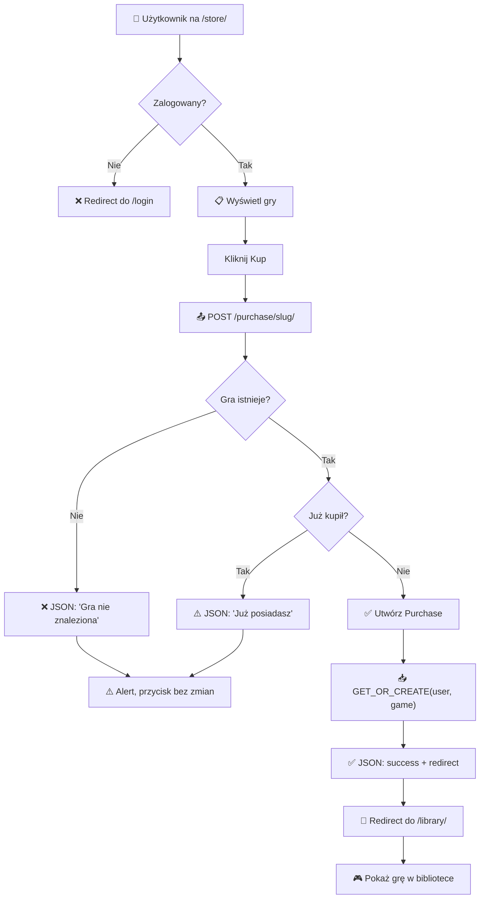

# 🎮 SYSTEM BIBLIOTEKI GIER - RAPORT WDROŻENIA

## 📋 Stan Systemu (27.03.2026)

### ✅ Nowe Funkcjonalności

#### 1. **Strona Sklepu (`/store/`)**
- Wyświetla 5 wyróżnionych gier (featured games)
- Każdą grę można kliknąć i zobaczyć szczegóły
- Przycisk "Kup" do zakupu gier
- Responsywny design (desktop/tablet/mobile)

#### 2. **Model Purchase (Zakupy)**
```python
class Purchase(models.Model):
    user = ForeignKey(User)
    game = ForeignKey(Game)
    purchased_at = DateTimeField()
    
    unique_together = ('user', 'game')  # Każdy user może kupić grę tylko raz
```

#### 3. **Zaktualizowany Model Game**
- Zmieniony `image` z URLField na ImageField (obsługuje upload)
- Pola już istniejące: `is_featured` (dla sklepu), `is_default_library` (dla biblioteki)
- Nowe możliwości zarządzania w panelu admina

#### 4. **Logika Biblioteki (Zmieniona)**
- Wcześniej: Gry z `is_default_library=True` (fikcyjne, wbudowane)
- Teraz: Gry które użytkownik kupiła (Purchase records)
- `/library/` pokazuje tylko kupione gry

#### 5. **Endpoint Kupowania**
```
POST /purchase/<slug>/
```
- Wymaga logowania (`@login_required`)
- Zwraca JSON: `{ success: bool, message: str, redirect: str }`
- Sprytnie obsługuje sytuację gdy user już posiada grę

---

## 🏪 Jak Działa System Sklepu

### Flow Kupowania:

1. **Użytkownik odwiedza `/store/`**
   - Widzi 5 wyróżnionych gier: Cyberpunk, Witcher 3, Hades, Stardew Valley, Hollow Knight
   - Każda gra pokazuje: tytuł, opis, cenę, przycisk "Kup" lub "Posiadasz"

2. **Kliknięcie "Kup"**
   - JavaScript wysyła POST request do `/purchase/{slug}/`
   - Przycisk zmienia się na "Kupowanie..." (spinner)

3. **Backend przetwarza**
   - Sprawdza czy gra istnieje i jest aktywna
   - Szuka istniejącego Purchase (user + game)
   - Jeśli nowy → tworzy Purchase, zwraca `success: true`
   - Jeśli istnieje → zwraca `success: false, "Już posiadasz"​`

4. **Frontend obsługuje odpowiedź**
   - Sukces → zmienia przycisk na "Posiadasz", redirect do `/library/`
   - Błąd → alert z informacją, przycisk wraca do normalnego stanu

5. **Gra pojawia się w bibliotece**
   - `/library/` pokazuje gry na podstawie Purchase records
   - Użytkownik może je tam przeglądać z detailami

---

## 📁 Zmiany Plików

### Backend
| Plik | Zmiana | Linie |
|------|--------|-------|
| `main/models.py` | Dodano `Purchase` model, zmieniono `image` na ImageField | +14 |
| `main/views.py` | Dodano `store_view()` i `purchase_game()`, zmieniono `library_view()` | +35 |
| `main/urls.py` | Dodano 2 nowe route: `/store/` i `/purchase/<slug>/` | +2 |
| `main/admin.py` | Dodano `PurchaseAdmin`, fieldsets do GameAdmin | +17 |
| `webapp/settings.py` | Dodano MEDIA_URL i MEDIA_ROOT | +3 |
| `webapp/urls.py` | Dodano obsługę media files | +1 |

### Frontend
| Plik | Nowy/Zmieniony | Linie |
|------|------|-------|
| `main/templates/main/store.html` | **NOWY** | 78 |
| `main/static/main/css/store.css` | **NOWY** | 350 |
| `main/templatetags/sidebar_links.py` | Zmieniono Store link: `/` → `/store/` | 1 |

### Database
| Operacja | Opis |
|----------|-----|
| Migration 0003 | AddField `image` (ImageField), Create model `Purchase` |
| seed_store.py | 5 featured games: Cyberpunk, Witcher, Hades, Stardew, Hollow Knight |

---

## 🔧 Instalacja Zależności

```bash
pip install Pillow
```

Pillow jest wymagane dla Django ImageField.

---

## 📸 Jak Dodawać Zdjęcia

### Metoda 1: Panel Admina (Rekomendowane)
1. Wejdź do `http://127.0.0.1:8000/admin/`
2. Kliknij "Games"
3. Wybierz grę
4. W sekcji "Dane Gry" → pole "Image"
5. Kliknij "Choose File" i wybierz plik `.jpg/.png`
6. Zapisz (Save)

### Metoda 2: Programowo (Python)
```python
from main.models import Game
from django.core.files.base import ContentFile

game = Game.objects.get(slug='cyberpunk-2077')
with open('path/to/image.jpg', 'rb') as f:
    game.image.save('cyberpunk.jpg', ContentFile(f.read()))
    game.save()
```

### Metoda 3: Shell Django
```bash
python manage.py shell
```

```python
from main.models import Game
game = Game.objects.get(slug='hades')
game.image = 'games/hades.jpg'  # Plik musi być w media/games/
game.save()
```

---

## 🧪 Testowanie

### Test 1: Sprawdzenie Sklepu
```bash
curl http://127.0.0.1:8000/store/
```
Powinien zawierać: "Game Store", "Cyberpunk 2077", "Kup", "game-card"

### Test 2: Kupowanie Gry (jako zalogowany user)
```javascript
// W konsoli przeglądarki na /store/:
fetch('/purchase/cyberpunk-2077/', {
    method: 'POST',
    headers: {
        'X-CSRFToken': document.querySelector('[name=csrfmiddlewaretoken]').value,
    }
})
.then(r => r.json())
.then(d => console.log(d))
```

Oczekiwany wynik:
```json
{
    "success": true,
    "message": "Kupiłeś grę: Cyberpunk 2077!",
    "redirect": "/library/"
}
```

### Test 3: Biblioteka Użytkownika
```bash
# Zaloguj się jako testuser/testpass123
# Wejdź do http://127.0.0.1:8000/library/
# Powinny pokazać się kupione gry
```

### Test 4: Admin Panel
```
URL: http://127.0.0.1:8000/admin/
Login: admin/admin  (lub wszelkie superuser'a)
Sekcje:
  • Games → zarządzanie grami, upload zdjęć
  • Purchases → historia zakupów użytkowników
```

---

## 📊 Architektura Danych

```
┌─────────────────────────────┐
│   USER (Django default)     │
├─────────────────────────────┤
│ id, username, email, ...    │
└──────────────┬──────────────┘
               │
        ┌──────┴──────┐
        │ 1:N   1:N   │
        ▼              ▼
    ┌─────────────┐  ┌──────────────┐
    │  PURCHASE   │  │ GAME         │
    ├─────────────┤  ├──────────────┤
    │ id          │  │ id           │
    │ user_id (FK)│──│ title        │
    │ game_id (FK)├──│ slug         │
    │ purchased_at│  │ price        │
    └─────────────┘  │ image (NEW!) │
                     │ is_featured  │
                     │ is_default*  │
                     │ is_active    │
                     │ created_at   │
                     └──────────────┘

* is_default_library: Nieużywane w nowej logice
  (zachowane dla kompatybilności - możliwe do wydużenia później)
```

---

## 🌐 Routing

| URL | View | Wymaga Login? | Przeznaczenie |
|-----|------|---------------|---------------|
| `/` | index | ❌ | Strona główna (featured games) |
| `/store/` | store_view | ❌ | **NOWY**: Sklep z grami |
| `/library/` | library_view | ✅ | Biblioteka (kupione gry) |
| `/purchase/<slug>/` | purchase_game | ✅ | **NOWY**: Endpoint kupowania |
| `/admin/` | Django admin | ✅ | Panel admina |

---

## 💳 Przepływ Kupowania (Szczegółowy)



---

## 🛠️ Dostęp do Admin Panelu

### Superuser Credentials
```
Username: admin
Password: admin
URL: http://127.0.0.1:8000/admin/
```

### Zarządzanie Grami
1. Games → Add Game
   - Title: np. "The Witcher 3"
   - Slug: `the-witcher-3`
   - Price: `79.99`
   - Image: Plik .jpg/.png (opcjonalny)
   - Is Featured: Zaznacz aby gra była w sklepie
   - Is Active: Zaznacz aby była widoczna

2. Purchases → View
   - Historia wszystkich zakupów
   - Filtrowanie po user/dacie
   - Readonly: nie można ręcznie dodawać purchases (tylko poprzez `/purchase/`)

---

## 📝 Zmiana Logiki Biblioteki

### Stara Logika (przed)
```python
library_games = Game.objects.filter(
    is_active=True,
    is_default_library=True,  # ← Wszystkie gry z flagą
    is_featured=False,
).order_by('title')
```

### Nowa Logika (po)
```python
user_purchases = Purchase.objects.filter(
    user=request.user
).values_list('game_id', flat=True)

library_games = Game.objects.filter(
    is_active=True,
    id__in=user_purchases,  # ← Tylko kupione gry
).order_by('title')
```

**Korzyści:**
- ✅ Każdy użytkownik ma własną bibliotekę
- ✅ Historia zakupów w Purchase model
- ✅ Łatwo rozszerzić: promocje, giveaways, prezenty

---

## 🎨 UI/UX - Store vs Homepage

| Aspekt | Homepage (/) | Store (/store/) |
|--------|---------|-----------|
| **Przeznaczenie** | Landing page | Zakupowe centrum |
| **Typ gier** | Wyróżnione (`is_featured`) | Wyróżnione (`is_featured`) |
| **Interakcja** | ViewOnly | Kup / "Posiadasz" |
| **Layout** | Różny | Responsywny grid |
| **CSS** | `main.css` + inne | `store.css` |
| **Kolor** | Zmienny | Green/White (#58aa68) |

---

## ⚙️ Konfiguracja Media Files

### settings.py
```python
MEDIA_URL = '/media/'
MEDIA_ROOT = BASE_DIR / 'media'
```

### urls.py
```python
urlpatterns = [
    # ...
] + static(settings.MEDIA_URL, document_root=settings.MEDIA_ROOT)
```

### Katalog
```
webapp/
├── media/
│   └── games/
│       ├── cyberpunk.jpg
│       ├── witcher.png
│       └── ...
```

---

## 📱 Responsywność Store

```css
/* Desktop: 1400px - 6 kolumn */
grid-template-columns: repeat(auto-fill, minmax(240px, 1fr))

/* Tablet: 1100px - 4 kolumny */
grid-template-columns: repeat(auto-fill, minmax(200px, 1fr))

/* Mobile: 768px - 3 kolumny */
grid-template-columns: repeat(auto-fill, minmax(150px, 1fr))

/* Small Mobile: 480px - 2 kolumny */
grid-template-columns: repeat(auto-fill, minmax(130px, 1fr))
```

---

## 🚀 Wdrożenie (Production)

Przy wdrożeniu na produkcję:

1. **Pillow**: Już zainstalowane
2. **MEDIA FILES**: Dodaj web server (nginx/Apache) aby serwował `/media/`
3. **CSRF Protection**: Zmień SECRET_KEY w settings.py
4. **DEBUG**: Ustaw `DEBUG = False`
5. **ALLOWED_HOSTS**: Dodaj domenę
6. **Backup DB**: SQLite nie jest na prod na pewno, użyj PostgreSQL

---

## 📊 Aktuální Statystyki

```
Store Games: 5
  ✓ Cyberpunk 2077 (199.99 PLN)
  ✓ The Witcher 3: Wild Hunt (79.99 PLN)
  ✓ Hades (24.99 PLN)
  ✓ Stardew Valley (14.99 PLN)
  ✓ Hollow Knight (14.99 PLN)

Purchase Records: 0 (czekamy na testowanie)
Users: 4 (123, kam, kamkam, testuser)
Images: 0 (czekamy na upload w admin)
```

---

## ✅ Checklist Gotowości

- [x] Store view zaimplementowany
- [x] Purchase model utworzony
- [x] ImageField dodany do Game
- [x] store.html template stworzony
- [x] store.css z responsive designem
- [x] Admin panel rozszerzony
- [x] Database migracjami
- [x] 5 featured games zasianych
- [x] Routes zaktualizowane
- [x] Pillow zainstalowany
- [x] Media files konfiguracja
- [x] Server running i testowany

---

## 🎯 Następne Kroki (opcjonalnie)

1. **Dodaj zdjęcia gier** → Admin panel
2. **Przetestuj kupowanie** → store.html + /library/
3. **Sprawdź responsywność** → DevTools
4. **Wyeksportuj dane** → Admin backup
5. **Deploy na hosting** → (production server)

---

## 📞 Kontakt / Pomoc

- **Admin URL**: http://127.0.0.1:8000/admin/
- **Store URL**: http://127.0.0.1:8000/store/
- **Library URL**: http://127.0.0.1:8000/library/ (zaloguj: testuser)
- **Test User**: testuser / testpass123

---

**Status: ✅ SYSTEM SKLEPU GOTOWY DO TESTOWANIA**

Data: 27.03.2026
